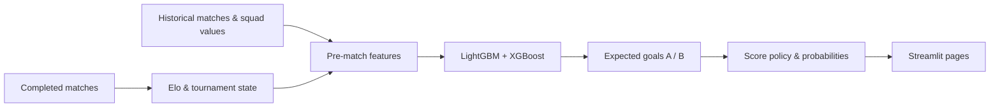

# World Cup Score Predictor

Predict football scores, explore match probabilities, and follow a tournament from the group stage to the final.

A Python / Streamlit application built around historical Elo ratings, squad values, pre-match features, and an ensemble of LightGBM and XGBoost models. Three saved model versions remain available for comparison; V4 is the application default.

## Quick start

Use Python 3.11. On macOS, LightGBM may require the OpenMP runtime (`brew install libomp`).

```bash
python3 -m venv .venv
source .venv/bin/activate
python -m pip install -r requirements.txt
python -m streamlit run src/app/streamlit_app.py
```

On Windows, activate with `.venv\Scripts\activate`. Saved models and input data are included. No API key or retraining is needed to run the app. Only load model artifacts from a trusted source: joblib uses Python serialization.

## What you can do

- **Single match:** inspect expected goals, predicted score, outcome probabilities, and the actual feature row.
- **Tournament simulation:** advance through the group and knockout stages.
- **Live tournament:** enter results, update standings and Elo, and inspect adaptive calibration. This page can write local result files.

## How it works



Feature construction, goal estimation, score selection, and tournament state are separate responsibilities. The model predicts two goal expectations; selecting a score is a subsequent policy decision.

## Read the project

| Location | Why it exists |
| --- | --- |
| [`src/app/`](src/app/) | Three user-facing pages |
| [`src/features/`](src/features/) | Feature definitions and pre-match construction |
| [`src/models/`](src/models/) | Model classes, training, weighting, and score policies |
| [`src/state/`](src/state/) | Elo, observed results, and tournament calibration |
| [`src/tournament/`](src/tournament/) | Group standings and knockout qualification |
| [`src/data/`](src/data/) | Input loading and validation |
| [`src/evaluation/`](src/evaluation/) | Metrics and research evaluation |
| [`notebooks/`](notebooks/README.md) | Eight retained notebooks explaining the research pipeline |
| [`scripts/`](scripts/README.md) | Training, evaluation, feature rebuild, and data collection |
| [`tests/`](tests/) | Automated behavior checks |

Start with [architecture](docs/ARCHITECTURE.md), then follow the [Hebrew study route](docs/STUDY_HE.md). Read [data and model provenance](docs/DATA.md) before running training.

## Development

```bash
python -m pip install -r requirements-dev.txt
python -m pytest -q
```

For research notebooks and collection tools:

```bash
python -m pip install -r requirements-notebooks.txt
```

Browser-based collectors also require Playwright's browser installation. Research scripts can overwrite datasets or model artifacts: use a separate checkout when experimenting.

## Honest evaluation

This is a research and demonstration project. Historical cross-validation includes time-ordering limitations; saved results are not an independent estimate of future accuracy. V6's score policy and the single-match probability display also use different calibration paths. The repository's 2026 snapshot contains **102 recorded results**, not a live feed.

See [known limitations](docs/KNOWN_LIMITATIONS_HE.md). A tidy codebase does not resolve data leakage, establish a new benchmark, or imply that every notebook has been rerun.
